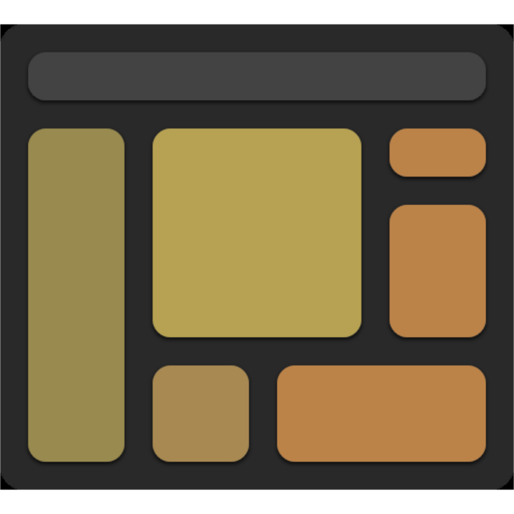

	

<h3 align="center">PATH.JERRYIO</h3>

The best path editor in VRC for designing skills routes and generating path files.

This is a Fork of the populat VEX Robotics path editor path.jerryio, which can be found at https://path.jerryio.com

But this is adapted to be used for First Lego League! 
